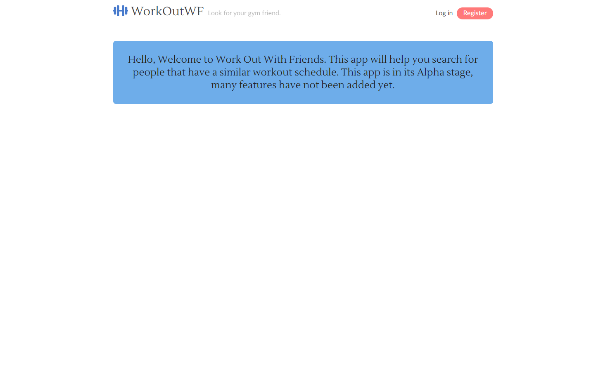
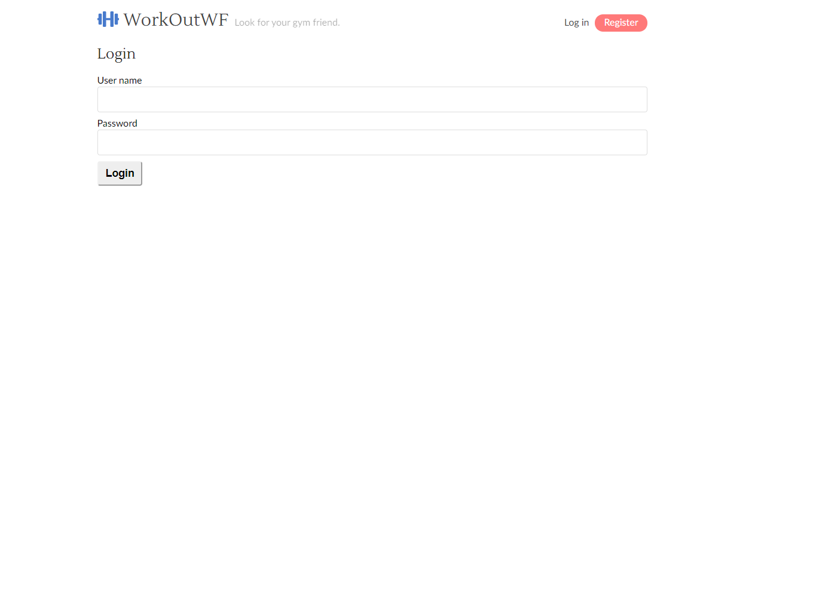
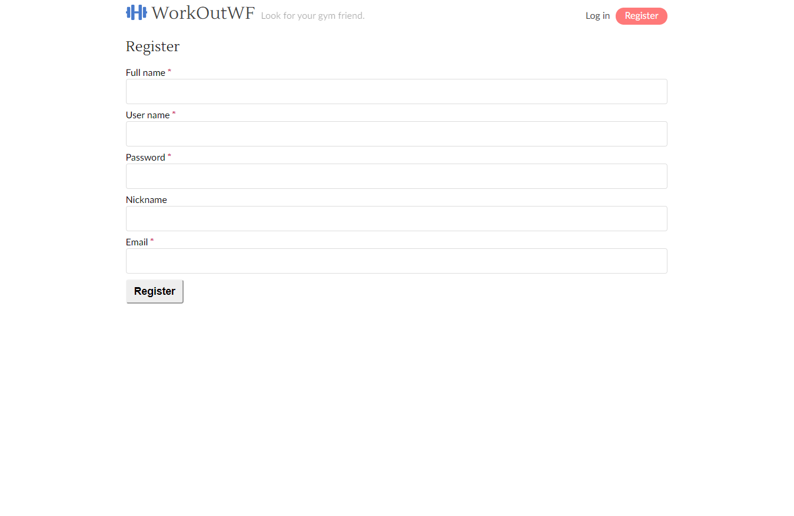
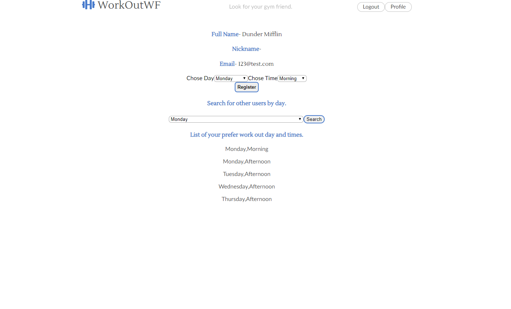

# WorkOutWF Server
WorkOutWF is an app that help to connect with others with a similar workout schedule. You can create a profile add in a day and general time that you are available to work out. After you can search by day and available times and find other users with that availability 

The code for the back end server can be found at 
[https://github.com/GLWolf/WorkOutWF-server].

The code for the client can be found at 
[https://github.com/GLWolf/WorkOutWF-client].


## Live Link
A live version of the app can be found at [https://workoutwf.now.sh/]

## App Demo






#### Front End

* React and OAuth
  * RESTful Api
  * Javascript (ES6)
  * React.js 
  * CSS3
  * HTML5
  * React-Vis (Uber)
  * Testing
  * Smoketest (integration)
  * Snapshot with Jest and Enzyme
  * Http Request
  * Fetch


#### Back End

  * SQL
  * Node.js
  * Express.js
  * Mocha

#### Production

Deployed via Heroku

## User Endpoints

Post new User
http://localhost:8000/api/user
Pass user_name, password, and email into the request body as JSON.

Login to existing user account
http://localhost:8000/api/auth/login
Pass user_name, and password into the request body as JSON. This will return an auth token and the users id that you will need for making requests to data endpoints.

## Data Endpoints

Get all day_time_user
http://localhost:8000/api/data
Pass user_id into get request header to return a list of all persisted tables.

Post new day_time_user
http://localhost:8000/api/data
Pass user_id and the new table_name into post request headers and pass the table data as JSON in the request body.

## Setting Up

- Install dependencies: `npm install`
- Create development and test databases: `createdb WorkOutWF`
- Create database user: `createuser users`
- Grant privileges to new user in `psql`:
  - `GRANT ALL PRIVILEGES ON DATABASE WorkOutWF TO users`
- Prepare environment file: `cp example.env .env`
- Replace values in `.env` with your custom values.
- Bootstrap development database: `npm run migrate`
- Bootstrap test database: `npm run migrate:test`

### Configuring Postgres

For tests involving time to run properly, your Postgres database must be configured to run in the UTC timezone.

1. Locate the `postgresql.conf` file for your Postgres installation.
    - OS X, Homebrew: `/usr/local/var/postgres/postgresql.conf`
2. Uncomment the `timezone` line and set it to `UTC` as follows:

```
# - Locale and Formatting -

datestyle = 'iso, mdy'
#intervalstyle = 'postgres'
timezone = 'UTC'
#timezone_abbreviations = 'Default'     # Select the set of available time zone
```

## Sample Data

- To seed the database for development: `psql -U users -d WorkOutWF -a -f seeds/seed.WorkOutWF_tables.sql`
- To clear seed data: `psql -U users -d WorkOutWF -a -f seeds/trunc.WorkOutWF_tables.sql`

## Scripts

- Start application for development: `npm run dev`
- Run tests: `npm test`